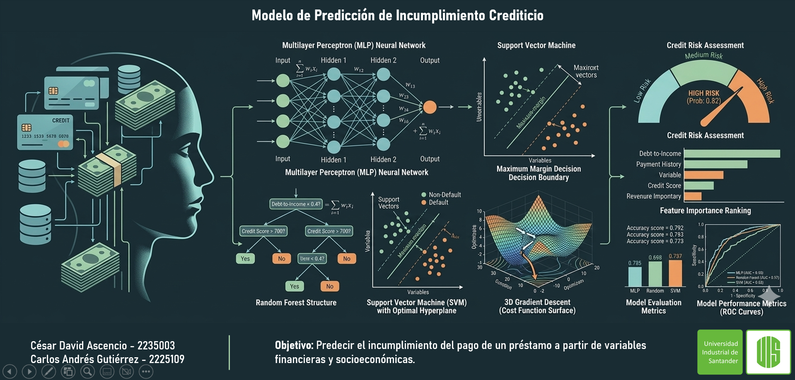

  

---

### Authors

- [Carlos Andres Gutierrez](https://github.com/cgr02) — 2225109  
- [Cesar David Ascencio](https://github.com/as-cesar) — 2235003

### Objective

Predicting whether a person will default on a loan using Machine Learning, Deep Learning,
and unsupervised learning techniques. Financial variables were used to train and compare
classification models to determine which best predicts the credit default risk of a loan applicant.

### Dataset

**Credit Risk Dataset — Kaggle**  
https://www.kaggle.com/datasets/laotse/credit-risk-dataset

This dataset simulates credit bureau information for training machine learning models capable
of predicting loan default risk. It contains **32,581 records** and **12 variables**, including
loan status (`loan_status` as the target variable), requested amount, annual income,
applicant age, interest rate, and prior credit history.

### Models

- Decision Tree Classifier — scikit-learn  
- Random Forest Classifier — scikit-learn  
- Support Vector Classifier (SVC) — scikit-learn  
- Deep Neural Network (DNN) — TensorFlow / Keras
- Non Supervised Learning 
- K-Means / DBSCAN
- PCA

### Resources

📓 Notebook — `credit_risk.ipynb` (available in this repository)  

📊 Slides3— `slides.pdf` [Canva link](https://canva.link/4dfuzw8juqpjjf5)

🎥 Video — [Watch on YouTube](https://youtu.be/6GwW-a3CWkE?si=7KGMUYVaKwxvMSFv)
